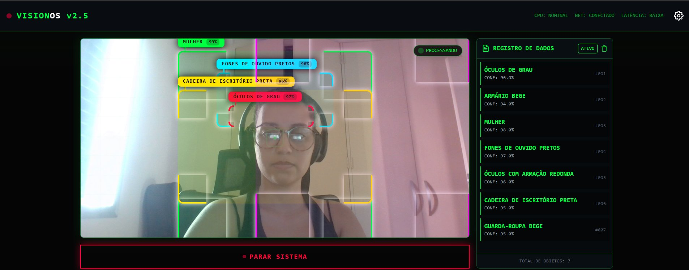

# 👁️ VisionOS — Detecção de Objetos em Tempo Real com Gemini

Sistema de visão computacional que usa a **Google Gemini API** para detectar e classificar objetos em tempo real via webcam, com interface estilo HUD (heads-up display).

<br>

<div align="center">

</div>

<br>

## 🎯 O que faz

O sistema captura frames da webcam e envia para a Gemini API, que retorna os objetos detectados com bounding boxes e confiança. A interface exibe tudo em tempo real com um visual inspirado em sistemas de monitoramento.

**Funcionalidades:**
- Detecção e classificação de múltiplos objetos simultaneamente
- Labels em português com percentual de confiança (94–99%)
- Bounding boxes coloridos por categoria
- Painel lateral de registro com listagem dos objetos detectados
- Monitoramento de CPU, rede e latência
- Interface dark com estética cyberpunk/HUD

<br>

## 🛠️ Stack

| Tecnologia | Uso |
|:---|:---|
| **Google Gemini API** | Visão computacional e classificação de objetos |
| **TypeScript** | Lógica da aplicação |
| **React** | Interface e componentes |
| **Vite** | Build e dev server |
| **Webcam API** | Captura de vídeo em tempo real |

<br>

## ▶️ Como rodar

```bash
git clone https://github.com/LauraMattz/computer_vision_gemini.git
cd computer_vision_gemini
npm install
```

Crie um arquivo `.env.local` com sua chave da Gemini API:

```
GEMINI_API_KEY=sua_chave_aqui
```

Depois:

```bash
npm run dev
```

Acesse `http://localhost:5173` e permita o acesso à webcam.

Ou teste direto no AI Studio: [Abrir no Google AI Studio](https://aistudio.google.com/apps/drive/1UfylZb7jdggCF1518lEVORb_vzaL460y?showPreview=true&showAssistant=true&fullscreenApplet=true)

<br>

## 📂 Estrutura

```
computer_vision_gemini/
├── components/     # Componentes React (câmera, HUD, painel lateral)
├── services/       # Integração com Gemini API
├── App.tsx         # Componente principal
├── types.ts        # Tipos TypeScript
├── index.html
└── vite.config.ts
```

<br>

## 📌 Resultados

Na demo, o sistema detectou **7 objetos simultâneos** com confiança entre 94% e 99%: óculos de grau, fones de ouvido, cadeira de escritório, armário, guarda-roupa — tudo em tempo real com latência baixa.

---

Feito por [Laura Mattos](https://github.com/LauraMattz) · [LinkedIn](https://www.linkedin.com/in/lauramattosc/)
